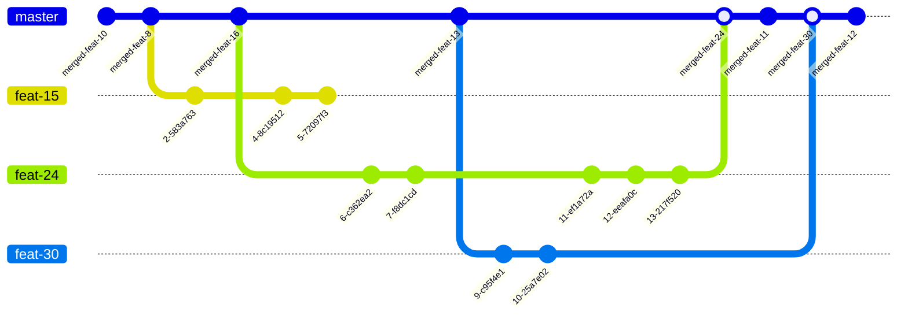

- [How to manage branches](#how-to-manage-branches)
  - [The master branch](#the-master-branch)
  - [Implement a new Feature](#implement-a-new-feature)
    - [Creating a Feature branch](#creating-a-feature-branch)


# How to manage branches
## The master branch
The master branch is our latest state of approved and merged changes. The master should always contain ***only*** code which could be build and is working. This is important because this is the origin for new features.

## Implement a new Feature
We use a feature branch workflow to organize and track work on different tasks. Each team member creates a dedicated branch for each Task they are working on. This allows development to happen in parallel. After they finished there work for this task they create a pull request with the feature branch. If every thing is building correctly and the implementation is reviewed by someone else (to reduce accidents) the feature branch gets merged into the master branch. 



### Creating a Feature branch 
0. Before you create a new branch ensure you have the latest changes fetched. 
```shell
git fetch
```
1. Create a new branch always from ``origin/master`` to start with the latest changes and reduce the chance to get merge conflicts. 

This will create a new branch called ``feat-new`` based on the remote master and switches to it. 
```shell
git checkout -b feat-new origin/master
```
2. Now you have your working branch where you can create your commits. 
> [!TIP]
> Try to keep your commits small, focused and related to a single change or topic. This makes it easier to find a meaningful commit message and makes it easier to understand your work during code review. 
3. When you are finished with all the work for your this task. It is time to Publish your branch (if not already) and ensure the latest changes are pushed. 
4. When you pushed your branch to GitHub you can create a pull request. Simply go to the repository and GitHub will most likely suggest to create a pull request for your branch. If not go to [your branches](https://github.com/4Source/prisma-plus-plus/branches/yours) and you will find new pull request in the branch menu. 
    - Ensure the correct base branch (master) is selected in Comparing changes and compare should be your branch.
    - You should get a predefined template where you can enter what you have changed and under Related Issues after Fixed enter the issue number. 
    e.g. ``Fixed #1`` The ``#`` is important for linking and the ``Fixed`` will ensure the issue gets closed if this pull request is merged.
5. Now someone has to review and approve your changes. They will than be merged into the master branch.